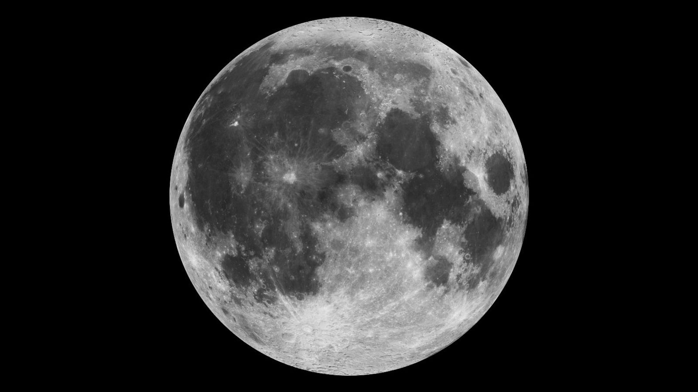
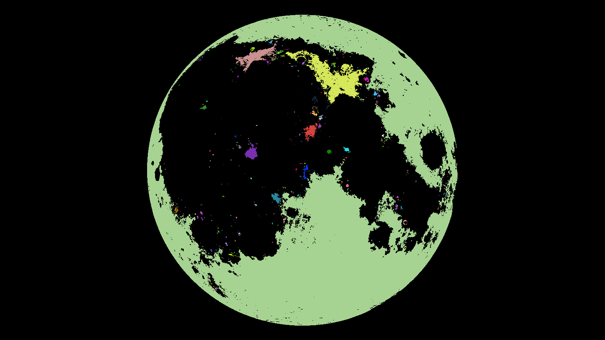
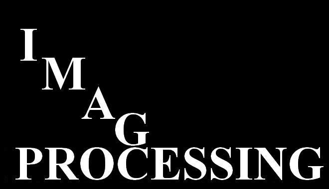
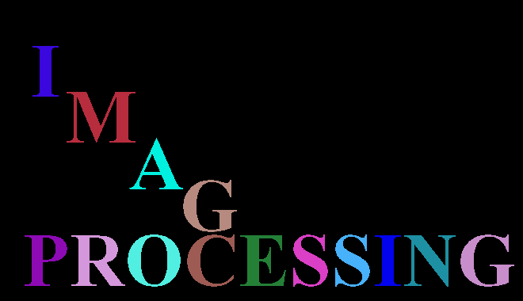

# connected-component-labeling
Simple two-pass algorithm with union-find data structure for connected component labeling.

## Steps to compile and run:
Make sure relevant packages are present (like OpenCV). To build with cmake run the following commands:
```sh
chmod +x build.sh
./build.sh
```
To run on an image:
```sh
./results/bin/ccl ./data/moon.jpg
```
## Example:
Output 1:
<p float="middle">
	 
	
</p>

Output 2:
<p float="middle">
	 
	
</p>